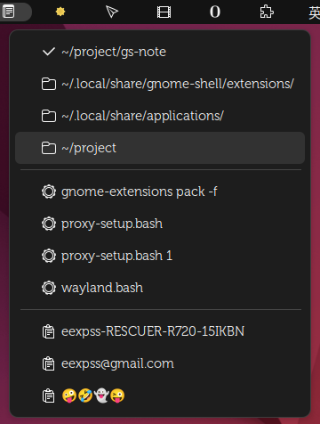

# gs-note

Add selected text to Note.

- Notes automatic recognition and sort as 'Directory' 'Command' 'Clipboard'.
- 'Directory': Mouse 1/2/3 act as 'Open in Files/Open in termianl/Paste dir'. It can be used as a temporary bookmark.
- 'Command': Mouse 1/3 as 'Excute command in Terminal/Paste cmd'.
- 'Clipboard': Mouse act as 'Paste to Clipboard(PRIMARY)'.
- Terminal support kgx(new gnome-console) and gnome-terminal.



```
⭕ tree ~/.local/share/gnome-shell/extensions/note@eexpss.gmail.com/
├── extension.js
├── schemas
│   ├── gschemas.compiled
│   └── org.gnome.shell.extensions.note.gschema.xml
└── metadata.json
```
